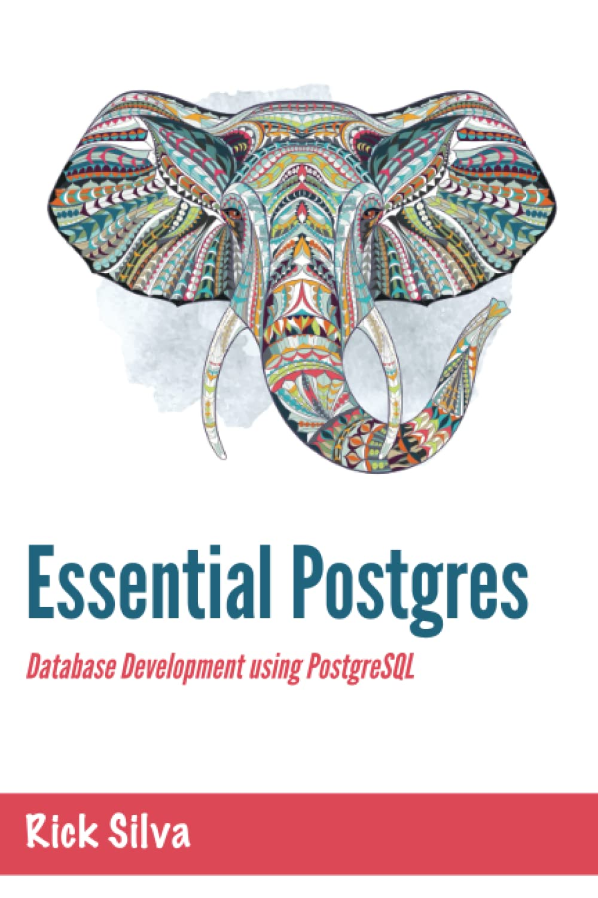

## Essential Postgres

**Essential Postgres** by Rick Silva is a book about the PostgreSQL database for beginner and intermediate database developers. The book gets right to the point, showing how to write Structured Query Language (SQL) statements, create tables, functions, triggers, views, and much more.

The book is available [here on Amazon](https://www.amazon.com/Essential-Postgres-Database-Development-PostgreSQL/dp/B08KH136G4). The book covers:

### Chapter 1 - Selecting Data from a Postgres Database
- Introducing Database Tables
- Introducing SQL
- Ordering Rows
- Null Values
- Formatting SQL
- Adding Comments to SQL
- Calling Postgres Functions
  - The upper() Function
  - The coalesce() Function
  - Calling Aggregate Functions
    - Using “Group By” with Aggregate Functions
    - A Rule of Thumb for Using “Group By”
- Using “Having” in SQL
- Don’t Repeat Yourself
- Joining Database Tables
- Table Aliasing
- Types of Joins
  * Inner Joins
  * Outer Joins
  * Cross Joins
  * Self Joins
- Column Aliasing
- Alternate Join Syntax
  - Using Parens
  - Joining with “Using” Instead of “On”
  - Old-School SQL
- Complex Joins with Multiple Tables
- Complex SQL Statements with Inner and Outer Joins
- String Concatenation
- Comparing Values in SQL
  * Greater Than
  * Greater Than or Equal to
  * Less Than
  * Less Than or Equal to
  * Not Equal
  * In Between
  * Like
  * Is Null
  * Not
- Subqueries
  * Correlated Subqueries
  * Subqueries that Return One Row
- Distinct
- Limit

### Chapter 2 - Creating and Changing Database Tables
- Data Types
  * Commonly-Used Data Types
    * Text
    * Integer
    * Numeric
    * Date
    * Time Without Time Zone
    * Time With Time Zone
    * Timestamp Without Time Zone
    * Timestamp With Time Zone
    * Boolean
    * Character
  - Less Commonly-Used Data Types
    * Numbers 
    * Formatted Data 
    * Serial
    * Bits and Bytes
    * Geometry-Related
    * Specialty Addresses
    * Miscellaneous
- Constraints
  * Primary Keys
    * Single Column Primary Keys
    * Multi-Column Primary Keys 
  * Foreign Keys 
  * Not Null Columns 
  * Unique
  * Check
- Indexes 
- Dropping Tables 
- Altering Tables Adding and Modifying Data 
  - Inserting Data 
    - The Number of Columns Must Match the Number of Values 
    - Always List your Columns 
  - Inserting Data from Another Table 
  - Updating Data 
- Deleting Data 
  - The Delete Statement 
  - The Truncate Statement 

### Chapter 3 - More Database Objects
- Views 
  * Using Views to Hide Sensitive Data 
- Materialized Views 
- Sequences 
- Creating Functions 
  * Parameters and Arguments 
  * SQL vs. PL/pgSQL 
  * Writing Functions with SQL 
  * Writing Functions with PL/PgSQL 
  * Return Types 
  * Dollar Quoting with Tags 
  * Parameters by Position vs Name 
  * Parameter Modes: In, Out, Inout, and Variadic 
- Procedures 
- Triggers 
  * Audit Triggers 
   * Creating the Audit Table 
   * Creating the Trigger Function 
   * Creating the Trigger 
   * Watching it Work 
   * Auditing Updates and Deletes 
- Special Variables for Triggers 
- Altering Triggers 
- Dropping Triggers 
- Disabling Triggers 
- Enabling Triggers 

### Chapter 4 - Built-In Functions
- Aggregate Functions
* abs() 
* upper() 
* lower() 
* initcap() 
* round() 
* trunc() 
* ceil() 
* floor() 
* length() 
* substr() 
* trim() 
* ltrim() 
* rtrim() 
* left() 
* right() 
* lpad() 
* replace() 
* format() 
* extract() 
* exp() 
* pi() 
* power() 
* random() 
* position() 
* version()

### Chapter 5 - Tips and Tricks
- PgAdmin 
- Connecting PgAdmin to a Postgres Server 
- Production Servers and Development Servers 
- Creating the Server Connections 
- The Tree Control Pane 
- The Query Tool 
- Changing a Table’s Column Order 
- Debugging with Raise 
- All Balls 
- Casting Data Types 
  - Functions for Casting 
    * to_date() 
    * to_timestamp() 
    * to_char() 
    * to_number() 
- Using Parens for Math 
- Transferring Data To and From Files 
- Loading Unstructured Data 
- Common Table Expressions 
- Calling Postgres from Programming Languages 

A reader asked if the SQL shown in the book is available online somewhere, so I put the scripts here in this GitHub repository. Enjoy!

Rick Silva
